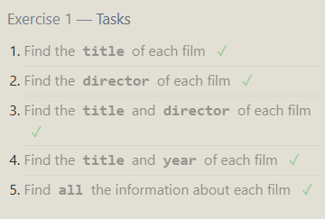
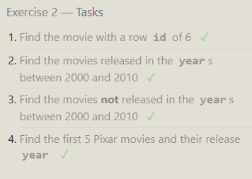
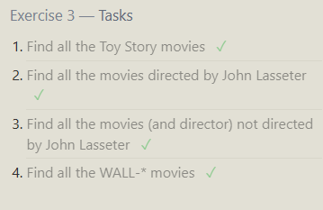
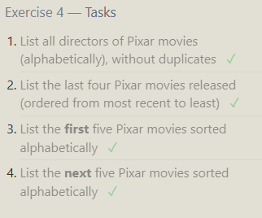
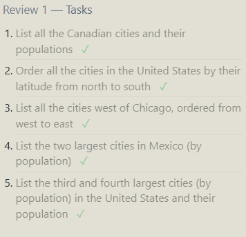
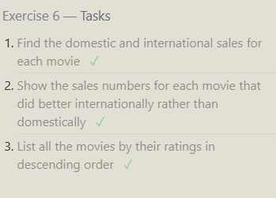

Exercise 1 — Tasks

Find the title of each film ✓
```sql
SELECT title FROM movies;
```
Find the director of each film ✓
```sql
SELECT director FROM movies;
```
Find the title and director of each film ✓
```sql
SELECT title , director FROM movies;
```
Find the title and year of each film ✓
```sql
SELECT title , year FROM movies;
```
Find all the information about each film ✓
```sql
SELECT * FROM movies;
```



Exercise 2 — Tasks

Find the movie with a row id of 6 ✓
```sql
SELECT * 
FROM movies
WHERE id=6;
```
Find the movies released in the years between 2000 and 2010 ✓
```sql
SELECT * 
FROM movies
WHERE year
BETWEEN 2000 AND 2010;
```
Find the movies not released in the years between 2000 and 2010 ✓
```sql
SELECT * 
FROM movies
WHERE year
NOT BETWEEN 2000 AND 2010;
```
Find the first 5 Pixar movies and their release year ✓
```sql
SELECT * 
FROM movies
WHERE id
BETWEEN 1 AND 5;
```



Exercise 3 — Tasks
Find all the Toy Story movies ✓
```sql
SELECT * 
FROM movies
WHERE title like 'Toy Story%';
```
Find all the movies directed by John Lasseter ✓
```sql
SELECT * 
FROM movies
WHERE director like "John Lasseter";
```
Find all the movies (and director) not directed by John Lasseter ✓
```sql
SELECT * 
FROM movies
WHERE director NOT like "John Lasseter";
```
Find all the WALL-* movies ✓
```sql
SELECT * 
FROM movies
WHERE title like 'WALL-_';
```




Exercise 4 — Tasks
List all directors of Pixar movies (alphabetically), without duplicates ✓
```sql
SELECT distinct director 
FROM movies
ORDER BY director;
```
List the last four Pixar movies released (ordered from most recent to least) ✓
```sql
SELECT title 
FROM movies
ORDER BY year desc
limit 4;
```
List the first five Pixar movies sorted alphabetically ✓
```sql
SELECT title 
FROM movies
ORDER BY title
limit 5;
```
List the next five Pixar movies sorted alphabetically ✓
```sql
SELECT title 
FROM movies
ORDER BY title
limit 5 offset 5;
```



Review 1 — Tasks

List all the Canadian cities and their populations ✓
```sql
SELECT City, Population FROM north_american_cities
WHERE Country like 'Canada';
```
Order all the cities in the United States by their latitude from north to south ✓
```sql
SELECT * FROM north_american_cities
WHERE Country like 'United States'
ORDER BY Latitude DESC;
```
List all the cities west of Chicago, ordered from west to east ✓
```sql
SELECT city
FROM north_american_cities
WHERE longitude < -87.629798
ORDER BY longitude;
```
List the two largest cities in Mexico (by population) ✓
```sql
SELECT * FROM north_american_cities
WHERE country like 'Mexico'
ORDER BY population DESC
LIMIT 2;
```
List the third and fourth largest cities (by population) in the United States and their population ✓
```sql
SELECT * FROM north_american_cities
WHERE country like 'United States'
ORDER BY population DESC
LIMIT 2 OFFSET 2;
```



Exercise 6 — Tasks

Find the domestic and international sales for each movie ✓
```sql
SELECT id, title ,domestic_sales, international_sales 
FROM movies
INNER JOIN Boxoffice
    ON movies.id = Boxoffice.movie_id;
```
Show the sales numbers for each movie that did better internationally rather than domestically ✓
```sql
SELECT id, title ,domestic_sales, international_sales 
FROM movies
INNER JOIN Boxoffice
    ON movies.id = Boxoffice.movie_id
    WHERE international_sales > domestic_sales;
```
List all the movies by their ratings in descending order ✓
```sql
SELECT id, title ,domestic_sales, international_sales 
FROM movies
INNER JOIN Boxoffice
    ON movies.id = Boxoffice.movie_id
    ORDER BY rating DESC;
```



```sql

```
```sql

```
```sql

```
```sql

```

```sql

```
```sql

```
```sql

```
```sql

```
```sql

```
```sql

```
```sql

```


